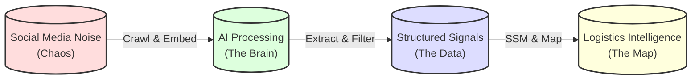
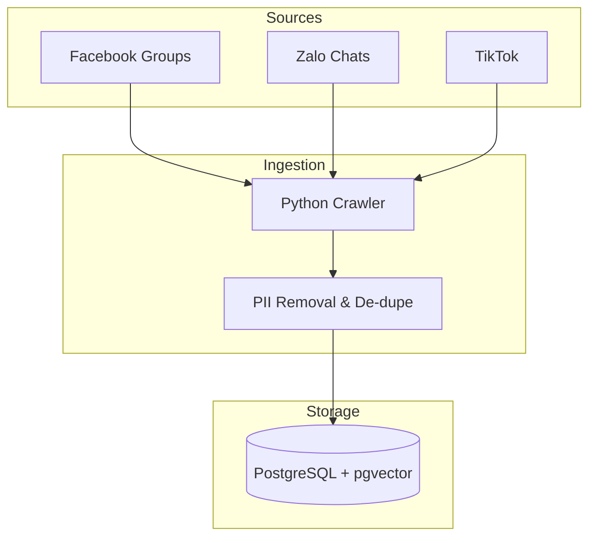
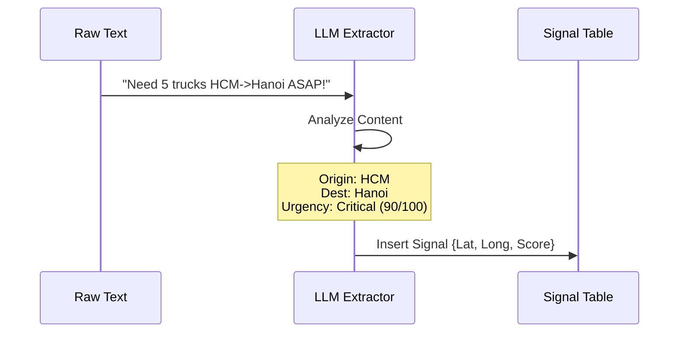
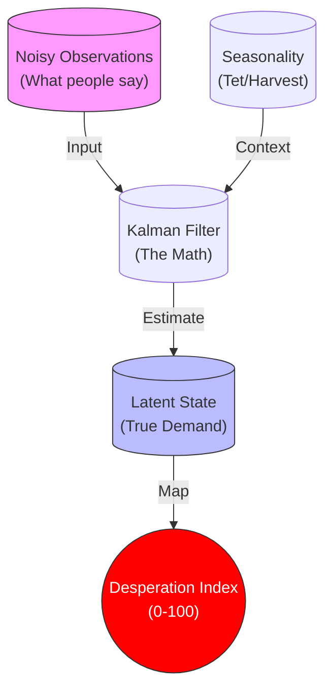

# SSFF: Socio-Spatial Freight Forecast
### Turning Social Chatter into Logistics Intelligence

**Presenter**: [Your Name]  
**Date**: February 2026

---

# Slide 2: The Problem

## The Logistics "Blind Spot"

*   **Lagging Data**: Traditional logistics relies on contracts and historical statistics (weeks/months old).
*   **The Reality**: The market moves fast. Real-time demand spikes happen in informal channels:
    *   Facebook Trucking Groups ("Cần xe gấp!")
    *   Zalo Driver Chats
    *   TikTok comments
*   **The Consequence**:
    *   **Shippers**: Panic booking & surge pricing (+30% costs).
    *   **Carriers**: Empty return legs because they missed the signal.

**We are optimizing based on the past, while the market lives in the present.**

---

# Slide 3: The Solution

## From Noise to Signal

We propose a **"Lakehouse" Architecture** that converts unstructured social text into a structured **Desperation Index**.

*   **Listen**: Monitor social channels 24/7.
*   **Understand**: Use AI to detect urgency and location.
*   **Predict**: Forecast demand before it hits the mainstream market.

---

# Slide 4: Data Pipeline

## Phase 1: Acquisition (The "Lake")

We ingest data from where the drivers and shippers actually talk.

*   **Raw Input**: Unstructured text, slang, emojis.
*   **Storage**: Vector embeddings allow semantic search (e.g., matching "cứu" with "urgency").

---

# Slide 5: Processing Phase

## Phase 2: Signal Extraction (The "Refinery")

Turning text into data points.

**Key Outputs**:
1.  **Origin/Destination**: Where is the demand?
2.  **Commodity**: What is moving? (Rice, Fruit, Steel)
3.  **Urgency Score**: How desperate is the shipper?

---

# Slide 6: The Innovation - SSM

## Phase 3: State-Space Model (SSM)

Social data is noisy. We use **Kalman Filtering** to find the truth.

*   **The Problem**: One person spamming "URGENT" isn't a crisis. 100 people doing it is.
*   **The Fix**: SSM smooths out the noise and combines it with seasonal baselines (Tet, Harvest) to produce a stable **Desperation Index**.

---

# Slide 7: Conclusion

## Moving from Reaction to Anticipation

**SSFF** gives logistics leaders a weather map for market volatility.

*   **Predict** congestion before it happens.
*   **Position** fleets proactively.
*   **Price** dynamically based on Desperation Index.

### Next Steps:
1.  Deploy Data Crawler (Phase 1)
2.  Calibrate Desperation Model
3.  Launch Pilot Dashboard

**Thank You.**
